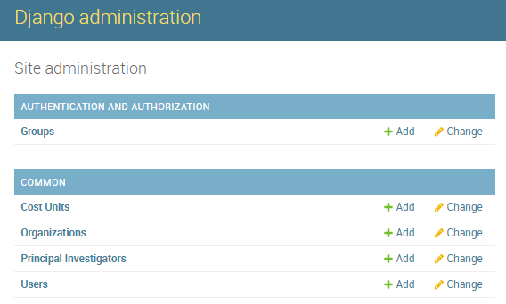
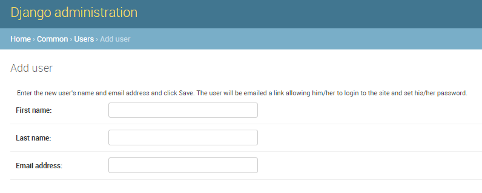
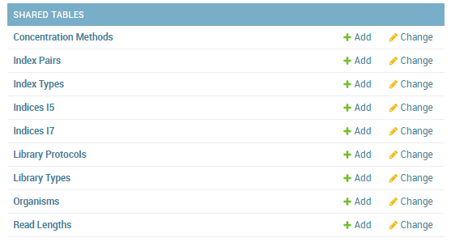

===============
Getting Started
===============

Managing accounts
#################

Parkour has a central user management to register new users, edit or delete existing users.

.. _admin-dashboard:

    Parkour site administration. Changing users.

Only users with staff status can enter the administration site to add or edit new users and allocate permissions.

To add a new user, open *Parkour* and go to site administration (/admin) and select “add” new user. Enter first name, last name and email address. A random password will be generated. Click “Save and continue editing”. Specify phone number, organization, principal investigator and cost unit. Multiple Cost units can be assigned to a single user. Depending on the role of the user, set permissions for the user; choose between: Active, Staff, and Superuser. Click “Save” to save the changes to the database.

.. _add-user:

    Parkour site administration. Add user.

Permissions
###########

A Parkour user can get assigned the following roles:

* **Active**. Users can create requests and view the status of their own requests. The user can attach files to a request. An active user will only see the request and the libraries and samples windows populated with data from own requests. All additional functions of Parkour are hidden for an active user.

* **Staff**. Users with the staff permission are typically any laboratory personal that is involved in request processing. Such users will see the complete Parkour software and all submitted requests and can edit requests at any time. Staff users can access administrator area to edit shared tables. It is possible to control/restrict access to selected parts of the administrators area. Note allocate “staff status” to a user select both, “activate” and “staff” in the administration site/permissions.

* **Superuser**. Users with the superuser permission have all the rights of staff users, editing rights for all shared tables in the system and the rights to add new users. No further restrictions can be set.  Note to allocate “superuser status” to a user select all, “activate”, staff” and “superuser” in the administration site/permissions.

Changing your password
######################

Upon registration in Parkour, a link is sent to your email address and you are asked to change your password. If you forgot your password, click on “Forgot password” on the main login page and change your password accordingly.

Adjusting Parkour Content
#########################

To customize Parkour to individual needs a staff user and higher can access the site administration and edit shared tables. For instance, to add a new library preparation protocol or edit/delete an existing protocol, go to shared tables and choose Library Protocols. Choose “Add Library Protocol” to add a new protocol. Enter information into the requested fields and save the changes. To edit any other parameter i.e. invoicing, sequencers, index types etc. follow the same strategy.

.. _shared-tables:

    Parkour site administration. Shared tables.
