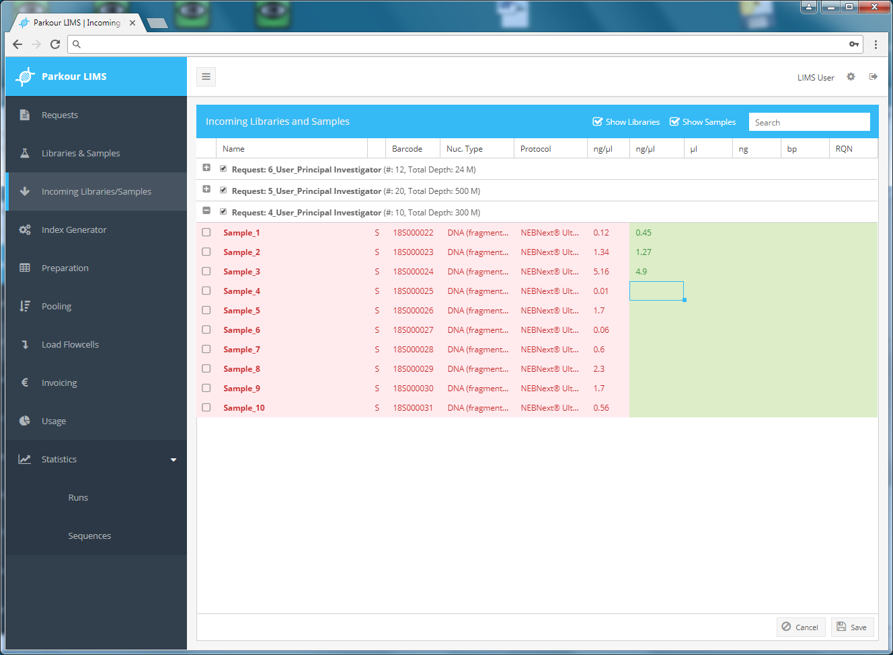

==============================
Incoming Libraries and Samples
==============================

Once a request is approved by the respective PI, status of all samples or libraries changes to “submission completed” and samples/libraries are appearing in the “Incoming Libraries and Samples” window. At this stage only users with permission set to “staff” will see the requests and can start conducting incoming sample/library quality control.

During “incoming quality control” each request is evaluated by users with “staff” permission, typically staff from the sample processing laboratory. Each request must pass predefined quality criteria. Even though a user has specified all parameters (i.e. sample concentration and sample integrity), samples will be requalified by members of the core facility. Any further steps in the workflow are based on quality parameters entered by the core facility. In case of quality issues, an email notification can be sent to the user.

Editing Incoming Libraries and Samples
######################################

Any user with staff permission can see and edit requests awaiting incoming quality control and quality approval. To start quality control, choose the “Incoming samples/libraries” window. All requests containing samples/libraries with status “submission completed” are displayed and can be assessed. Click on the plus/minus icon to expand/collapse the requests and list all samples or libraries belonging to a request.

In the Incoming Libraries and Samples window quality information for each submitted sample/library is displayed. Left side of the window/red: quality criteria entered by request holder; right side of the window/green, editable table to document quality control.

.. _incoming-libraries-samples:

    Incoming Quality Control module.

To enter parameters from i.e. concentration measurements choose a request and select a respective cell. Paste or type individual values into cells and press enter or save to fix values into the database. To paste a series of values into multiple cells, mark a cell, press Esc, start pasting data (ctrl + v).

To attach measurements reports to a request, choose from the request window your request, right click and choose view to start uploading files from the quality control step.

Quality Evaluation
##################

Once all measurements are conducted and documented in Parkour, staff of the sample processing laboratory can start quality evaluation. To this, mark individual samples or libraries using the checkbox attached to each sample or library. Right click and select either passed, compromised or failed. To evaluate all samples or libraries of a request at once, right click on the request header, choose “select all” and one of the three depicted quality options.

.. _incoming-libraries-samples-qc:

.. figure:: img/incoming_libraries_samples_qc.png
    :figwidth: 100 %
    :align: center

    Sample/library quality evaluation.

Once evaluated, all samples or libraries that passed the quality control will change status to “quality check approved”, clear from Incoming Libraries and Sample window and at the same time appear in the Index Generator window. All samples, evaluated as failed, will be rejected and will not appear in any of the subsequent steps. Such samples are flagged as failed and can be viewed in the window Libraries & Samples, Samples or libraries, evaluated as compromised, will move with the approved samples.
