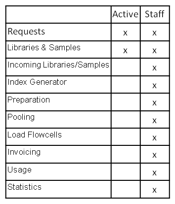

============
Introduction
============

Parkour LIMS supports sample processing laboratories, dealing with thousands of samples per year, with laboratory management, sample documentation, tracking, and evaluation. The LIMS has a web-based interface to be accessed by different user groups, that’ll profit from the software’s functionality. Any *active user* (see 2.2 permissions) can access the software, create new requests for Next Generation Sequencing (NGS), follow in real-time the status of the request over the different stages of the workflow, store any request related data for documentation, upload request related metadata to public sequencing data archives. User with *staff* permission and higher (see 2.2 permissions) can access any part of the software to edit and process requests and samples through the different stages of the workflow including *Request overview - Incoming Libraries and Samples - Index Generator - Preparation - Pooling - Load Flowcells - Invoicing - Usage - Statistics*. Access to the administrators area allows dynamic content adjustment as well as user management without any software programming knowledge.

The LIMS's general principles are a simple yet functional web interface, ease of use, user input validation, and fast data processing. Interestingly for software developers, Parkour’s dynamic structure allows for any program adjustments or implementation of new features into the existing workflow. Furthermore the program can be extended to support other than NGS workflows. Basically any samples processing laboratory can profits from the usage of Parkour as central laboratory management platform.

.. _parkour-sections:

.. table:: Sections of Parkour LIMS available for users with permissions “Active” and “Staff”
    :widths: auto

    +-----------------------------+--------+-------+
    |                             | Active | Staff |
    +=============================+========+=======+
    | Requests                    |    X   |   X   |
    +-----------------------------+--------+-------+
    | Libraries & Samples         |    X   |   X   |
    +-----------------------------+--------+-------+
    | Incoming Libraries/Samples  |        |   X   |
    +-----------------------------+--------+-------+
    | Index Generator             |        |   X   |
    +-----------------------------+--------+-------+
    | Preparation                 |        |   X   |
    +-----------------------------+--------+-------+
    | Pooling                     |        |   X   |
    +-----------------------------+--------+-------+
    | Load Flowcells              |        |   X   |
    +-----------------------------+--------+-------+
    | Invoicing                   |        |   X   |
    +-----------------------------+--------+-------+
    | Usage                       |        |   X   |
    +-----------------------------+--------+-------+
    | Statistics (Runs/Sequences) |        |   X   |
    +-----------------------------+--------+-------+

.. _requests:

.. figure:: img/requests.png
    :figwidth: 100 %
    :align: center

    Screenshot of Parkour after login for users with the permission *staff*

.. _modules-permissions:

    Parkour's modules for **Active** and **Staff** users

.. note::

    Users with the permission *active* will see only **Requests** and **Libraries & Samples**.
