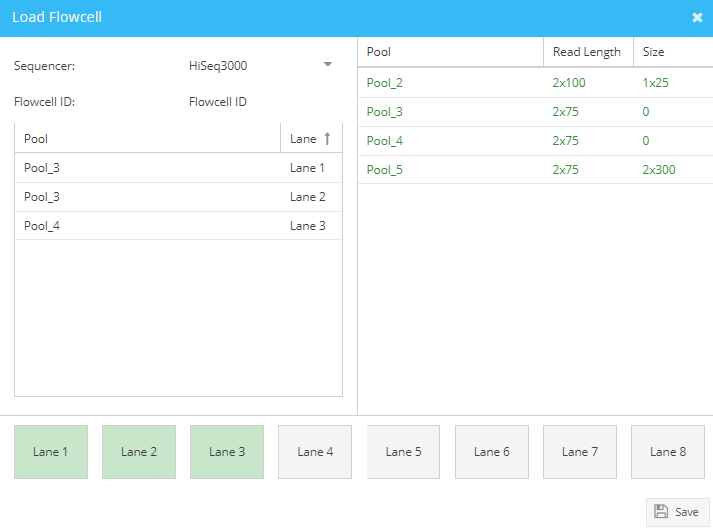

==============
Load Flowcells
==============

In the Flowcells tab, you can observe all flowcells loaded in a given time period and load pools onto flowcells to start a sequencing run.

Loading a flowcell
##################

To assign pools to lanes of a flowcell, click “Load” in the top right corner of the load flowcell window. The load flowcell dialogue appears. All Pools ready for loading (status pooled) appear in green. Pools colored in red are not ready for loading and can not be dragged onto a lane.

.. _load-flowcell-window:

    Load Flowcell window.

To start choose a sequencing instrument using the dropdown menu. Note that depending on the sequencer, you will see either one or eight lanes. Enter the flowcell ID. Start dragging the desired pools into the displayed lanes. Note that for loading of an 8-lane flowcell, read length and size of all pools must be identical (parameters are shown in the pool list). Also, all lanes must be loaded to complete the flowcell loading. Click “Save”. Sample status changes to “Sequencing”.

View the newly generated flowcell in the load flowcell window. Expand the flowcell to see all lanes loaded. Edit the loading concentration per lane as well as the percentage of Spike-in (i.e. PhiX) in use. To download the flowcell layout, select all lanes of a flowcell and click the “Download Benchtop Protocol” button. Especially for 8-lane flowcells this function is convenient to correctly match pools to lanes/8-well strips in the laboratory.

Generating a sample sheet
#########################

To download the sample sheet in CSV format expand the flowcell, select all lanes and click “Download Sample Sheet”. The generated CSV file contains all information needed to start the demultiplexing after a sequencing run is completed. Note: Parkour generates for all instruments and index designs sample sheets with identical formats.

