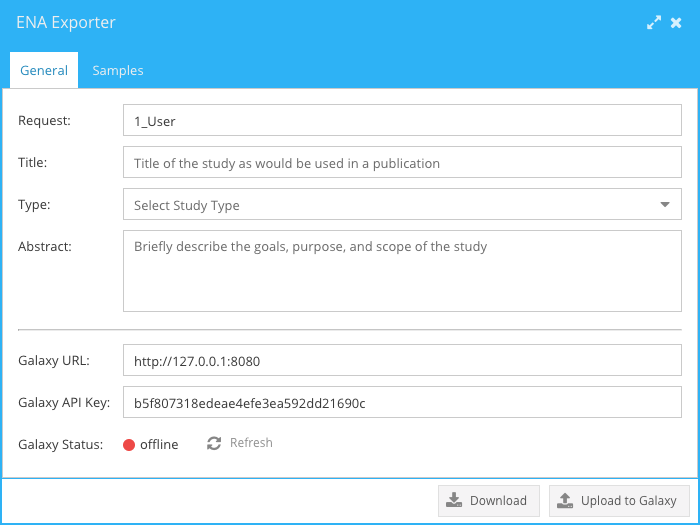
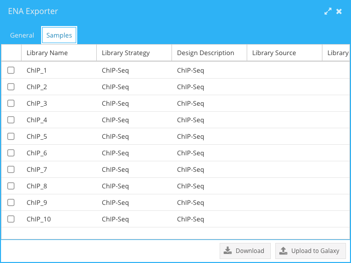

===============
Metadata Export
===============

To deposit sequences in a public archive (ENA) detailed documentation of the conducted experiment will be requested. Public repositories provide templates to standardize documentation and data upload. Parkour LIMS provides a convenient ENA Export tool that prepares data required for a successful upload to ENA. The system collects the data related to the experiment and asks the user to enter the remaining information. The upload is done in multiple steps. First, Parkour LIMS generates four TSV files, *studies.tsv*, *experiments.tsv*, *samples.tsv*, and *runs.tsv*. Then, they need to be uploaded to Galaxy, which will convert these TSV files into XML files accepted by ENA according to ENA rules. Secondary analysis can be done on metadata utilyzing Galaxy tools and workflows. Finally, an ENA upload tool in Galaxy will handle the upload.

To start working with the export tool, right-click on a request in the *Requests* tab and select *ENA Export*. The tool window will be shown where the user has to fill in general information about the experiment. Galaxy URL and API key must be specified in order to upload the files directly to Galaxy. Alternatively, this can be done by downloading the TSV files, previewing and manually uploading them to Galaxy.

    ENA Exporter. Entering general information about an experiment.

The window's second tab allows the user to enter and edit all sample metadata. The same editing capabilities, which are implemented across the whole system, can be used here, i.e., *Apply to All* and *per-cell editing*. Input validation ensures all the information is present.

    ENA Exporter. Editing sample metadata.

When all the required data is provided, the user can either download the TSV files or push them directly to Galaxy, which will upload the data to ENA.
