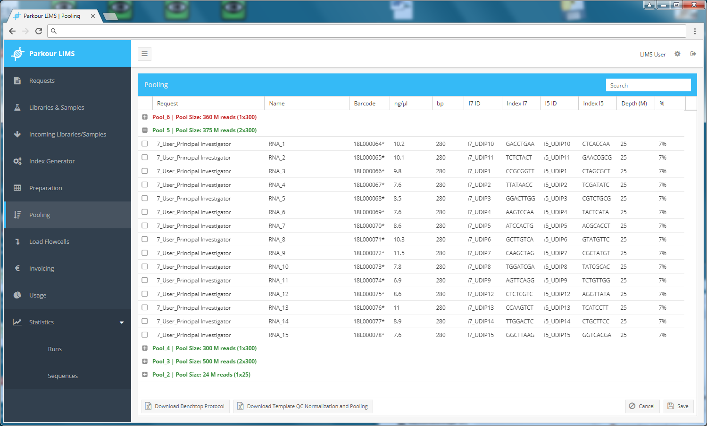

=======
Pooling
=======

In the Pooling stage, you can see all samples that reach the status library quality check passed. This can either be libraries generated in the core laboratory (submitted as sample) or libraries submitted to Parkour LIMS. Libraries are grouped by pool number.
All pools, ready for processing (all libraries in the pool reached the status “libraries prepared”) are colored in green. In contrast, pools containing non-finished libraries are colored in red.

To start pooling, select a Pool and expand the list of associated libraries by clicking on the plus/minus icon on the left.

To choose all libraries of a pool, right click on the header, click “Select All” and click “Download Benchtop Protocol”. All pooling-relevant information will be printed into a spreadsheet that can be used for further editing and serves as template to start library pooling.

Once pooling is completed, select all libraries in a pool and choose “passed”. Status changes to Pooling completed, ready for sequencing and Pool is cleared from Pooling window.

.. _pooling:

    Pooling module.
