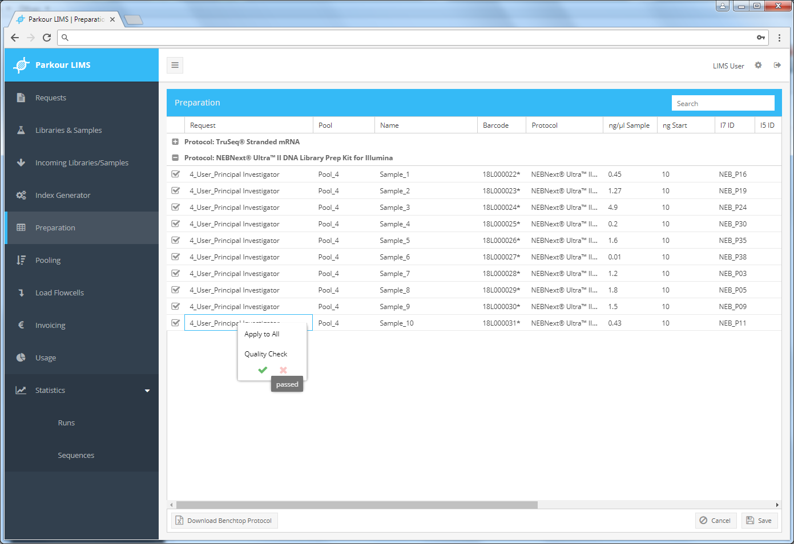

===========
Preparation
===========

All samples that undergo library preparation in the core facility will be listed in the preparation window of the Parkour LIMS. For simple overview and grouping of samples from multiple requests into a single library preparation, samples are grouped by protocol.  Note: Any submitted library will skip the prepartion step and directly appear in the pooling step. To view all samples awaiting preparation of a selected protocol, click on the plus/minus icon to expand/collapse the list of samples.

To start sample preparation, mark all samples to be prepared. Either check each individual sample or right click on the header to select all samples from the respective protocol.

Click “Download Benchtop Protocol” to generate a spreadsheet with all the information. This spreadsheet will be the basis to start sample input normalization by amount and volume. The spreadsheet is appointed with formulas needed to calculate starting volume of sample and buffer and contains the layout for index assignment.

To edit the records in the Parkour preparation table, mark the respective cell and enter or paste a value. Press enter or update to apply the changes. To edit the tables column-wise, choose the topmost cell press Esc and paste the data, e.g., concentration measurements into the respective column. To fill columns with identical values, type in a value press enter, right click, select “Apply to All” to fill subsequent cells with identical information.

Once all mandatory fields are filled, evaluate the library result and choose “passed” to approve library quality or “fail” to stop further processing. To evaluate individual or all samples belonging to a sample preparation protocol, mark the individual samples or mouse over the protocol header, right click, choose “select all” and carry out the evaluation for all marked samples. Once evaluated, libraries will disappear from the Preparation tab and appear in the Pooling tab. All failed libraries will be rejected and are marked in the Libraries and Samples tab with the status “failed”.

.. _preparation:

    Preparation module.
