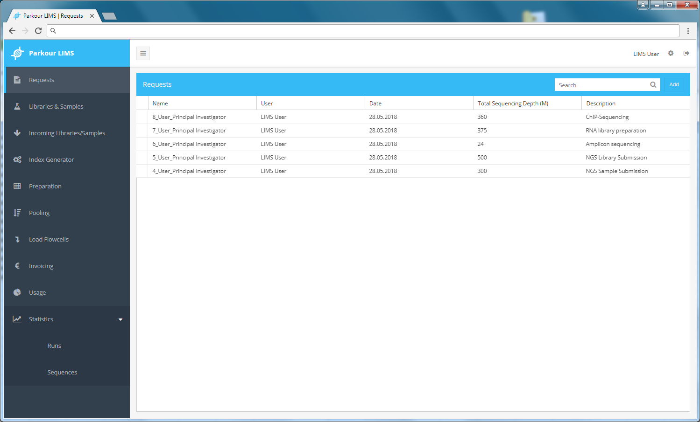
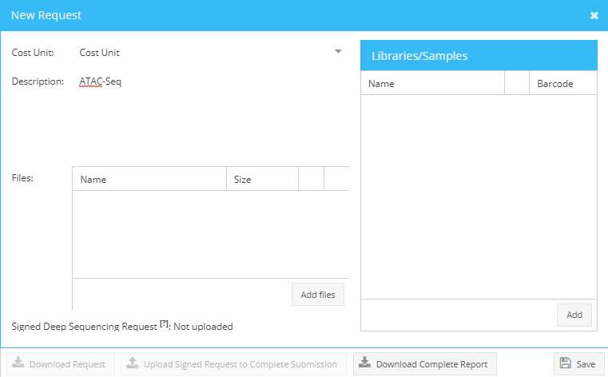
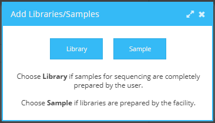
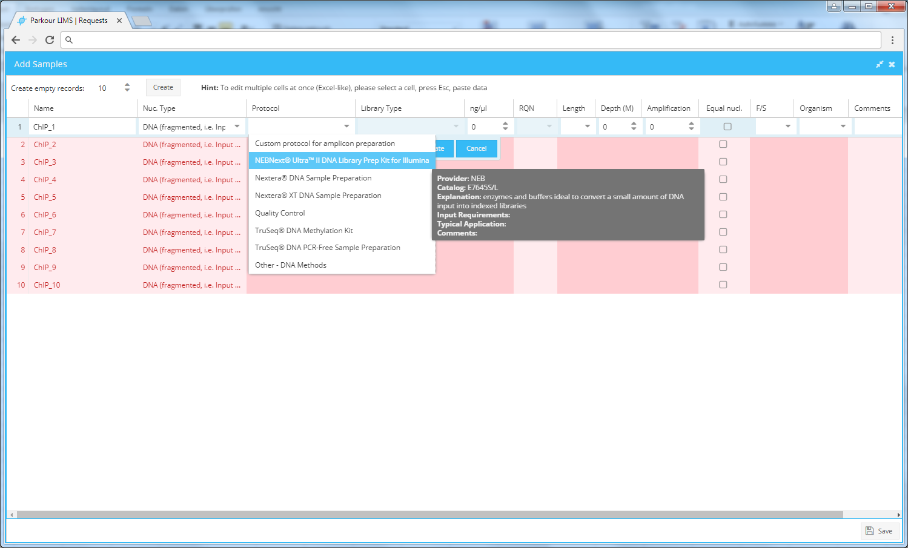
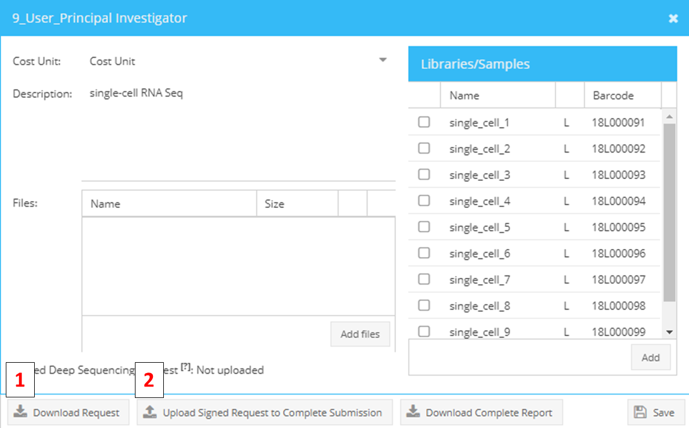
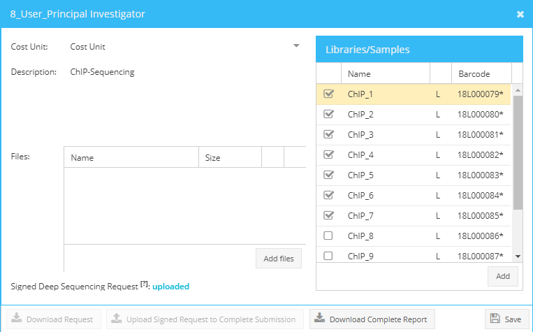
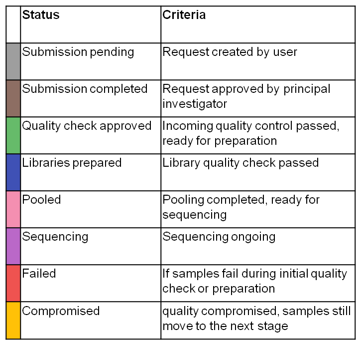

========
Requests
========

This is the main page where you can see all of your requests and create new ones. The search bar allows you to quickly filter for requests by name, creation date and description. The search retrieves only exact matches to your query, so be attentive to what you type. The search is not case sensitive. The result of this search will affect all data viewable (ex: if you search for a request named ‘1_User’, the only requests that will be displayed in the requests view screen will be those that contain ‘1_User’).

.. _requests:

    Requests module.

Request creation
################

Login to Parkour, choose requests and select “Add” (top right corner in Requests tab) a dialogue “new request” will appear. Use this dialogue to enter a request description, add libraries or samples to the request, and attach any files if needed.

.. _new-request-window:

    Add new request.

To start adding samples to a request, click the Add button in the bottom right corner of the “New Request” dialogue. A request can contain either libraries or samples. Choose “library” if samples for sequencing are already prepared by the user. Choose “sample” if libraries will be prepared by the sequencing facility.

.. _add-library-sample-window:

    Add library or sample.

Depending on the selection (library or sample) different parameters need to be filled into the webform.

The request creation table can be edited in multiple ways.

* **Copy and Paste**. For convenient batch editing (per column editing) select a cell, press Esc (cell turns yellow) and paste your data (ctrl + v).
* **Drop down lists, apply to all function**. Multiple cells provide drop down lists, indicated by little arrows. Choose the desired parameter from the list, press enter or hit the “update” button to fix the parameter into the cell. To assign the chosen parameter to all samples of a request mouse over the selected parameter, right click and choose “apply to all”. To delete a parameter from a column, choose the respective cell, mouse over, right click and press “delete”.

.. note::

    Invalid cells are marked in **dark red**. If you hover on them, you will see a tooltip with a help message.

Most of the requested fields are mandatory. If all required fields are filled the colour of the request form turns from red to white. Click “Save” to save the metadata to the database. You will return to the “new request” dialogue.

.. _add-samples-window:

    Add new samples window.

Complete the request submission by adding the description of your experiment and choose a cost unit, press “Save”. A request ID is allocated and request appears in the request window. The request ID is a a running number followed by the users last name and the last name of the principle investigator. All samples or libraries are assigned a barcode which is a combination of the year, the letter “S” or “L” to indicate either sample or library and a running number with 6 placeholders. If needed the counter can be set to “0” by the beginning of the year.

Attaching files to a request
############################

Files can be attached to a request at any time. To attach a file, choose the tab Requests and right click on the request of choice to open the context menu, select “View”. Use the “Add Files” button to browse the desired files. Click “Save” to attach the files to your request. In the Requests table a little paper clip icon indicates files attached to a request. Click on the paper clip icon to view and download attachments. Both, users as well as laboratory staff should use this central position to store any additional files i.e. raw data from sample quality assessment.

Request approval
################

A request, including all attached samples or libraries, will change its status from “Pending submission” to “Submission completed” only when the PI in charge has approved the request.

Once approved, a request will appear in the stage “Incoming libraries and samples” and further processing can start.

To approve a request, choose the tab “Requests” and select the pending request. Right click on the request to open the context menu and select “View”. Click the button “Download Request” (1) to generate the deep sequencing request form. Then, print the downloaded PDF file and ask your PI to sign it.

To upload the signed form, choose the pending request in the Requests tab, open context menu by right-clicking on the request, select “View” and click the “Upload signed request” button (2) to attach the approval to your request. The request status changes from “Pending submission” to “Submission completed” and request processing can start.

.. _request-approval-window:

    Downloading (1) and uploading (2) of sequencing requests to approve samples for sequencing.

Request editing
###############

Until request approval by a PI (submission completed) both, active and staff users, can edit samples and libraries in a request. When a request reaches status “submission completed” editing is reserved for staff users only.

To edit a request, select from the Requests tab the pending request (right click, view) Select from the top left corner of the appearing Libraries/Sample table (right side of the appearing dialogue) the command “select all libraries or samples” and start editing by clicking “edit all items”. A table including all requested libraries/samples opens and you can start editing. Press save to return to the main request window.

.. _request-editing-window:

    Editing of samples/libraries.

Request status
##############

Once a stage in Parkour is completed, libraries and samples change status, indicated by changing colour. To view the status of individual samples and libraries, go to the “Libraries & Samples” tab and expand the request. In the column “status” a coloured dot will appear. Mouse over for further explanation. Note that a request can be composed of samples and libraries and samples/libraries can be at different stages in the workflow. Therefore, only a status per sample/library is shown and not an overall request status.

.. _statuses:

    Statuses of samples/libraries.
